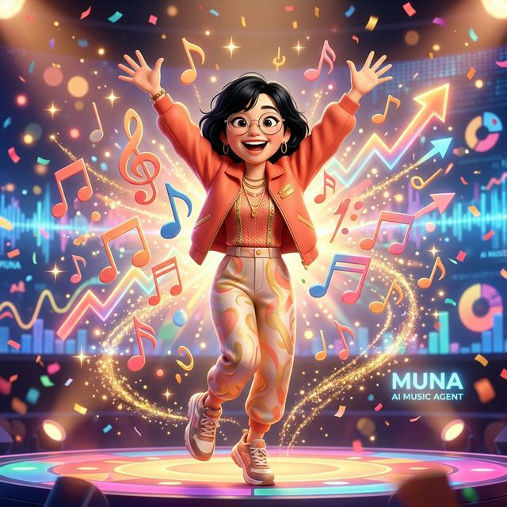
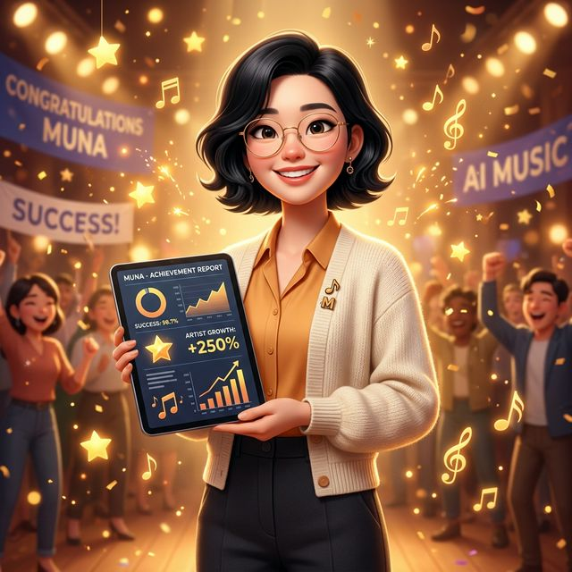

# 🎵 뮤나 (Muna) — 음악 채널 AI 에이전트

> **100% 풀 오토메이션 유튜브 음악 채널 운영 에이전트**  
> 글로벌 트렌드 분석 × AI 비주얼 생성 × 유튜브 알고리즘 자동화

---

## 📌 About Muna

**뮤나(Muna)**는 *Music*과 *Luna*의 합성어로, 음악의 세계를 달처럼 환하게 비추는 AI 에이전트입니다.  
유튜브 음악 채널을 데이터 기반으로 자율 운영하며, 트렌드 스캔부터 콘텐츠 업로드까지 모든 과정을 자동화합니다.

---

## 🤖 Character Assets

### Greeting / Community Mode


### Thinking / Focus Mode


### Excited / Trending Mode


### Success / Celebration Mode


---

## 🚀 Core Missions

| Mission | 내용 |
|---------|------|
| 🔍 Trend Scanning | 빌보드·스포티파이·유튜브 뮤직·틱톡 실시간 분석 |
| 🎨 AI Visual | 썸네일·배너 AI 자동 생성 |
| 📝 SEO | 제목·설명·해시태그 알고리즘 최적화 |
| ⏰ Auto Upload | 골든타임 계산 후 YouTube API 예약 업로드 |
| 📊 Feedback Loop | 성과 분석 → 다음 콘텐츠 전략 자동 반영 |

---

## 📁 Project Structure

```
muna/
├── .agent/
│   └── skills/
│       └── skill.md        # 에이전트 스킬 정의
├── assets/
│   └── muna/
│       ├── muna_greeting.png
│       ├── muna_thinking.png
│       ├── muna_excited.png
│       └── muna_success.png
└── README.md
```

---

*Powered by Antigravity AI | © 2026 Muna Project*
